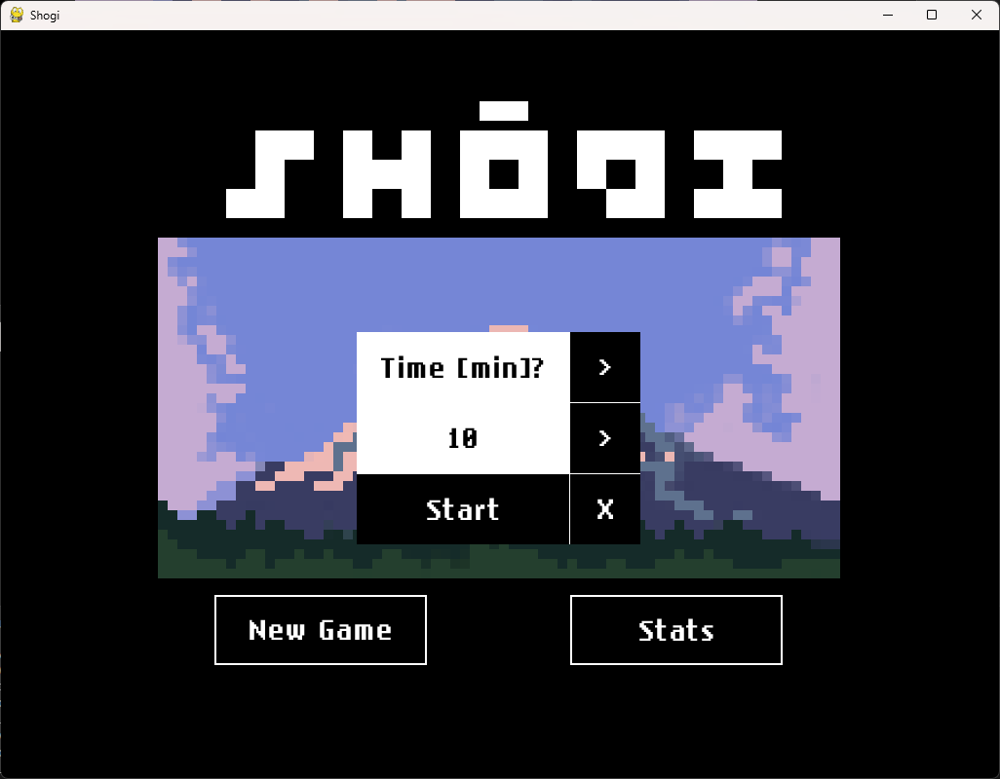
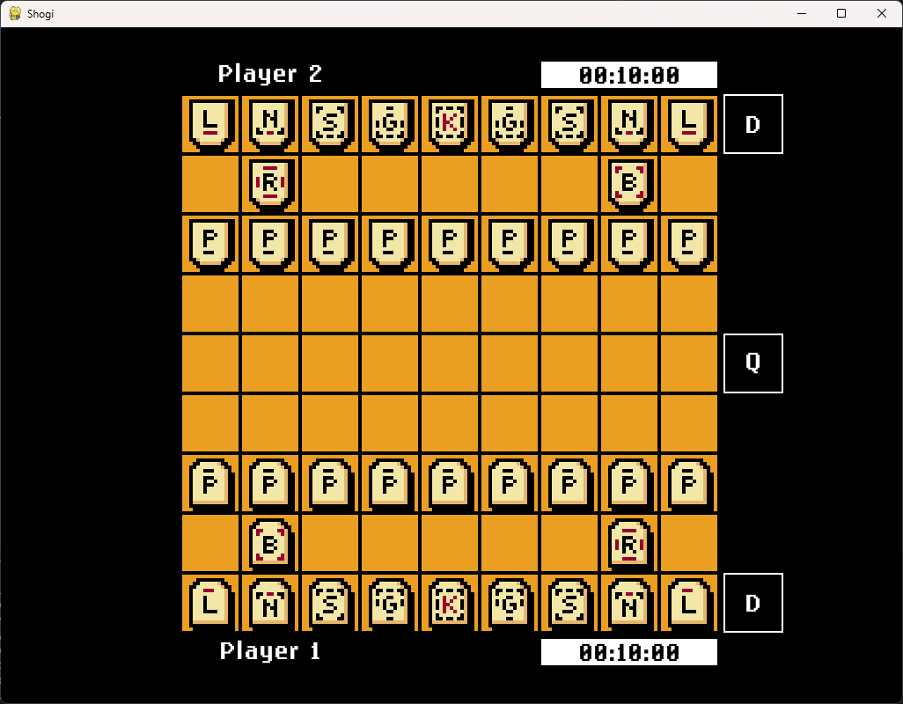
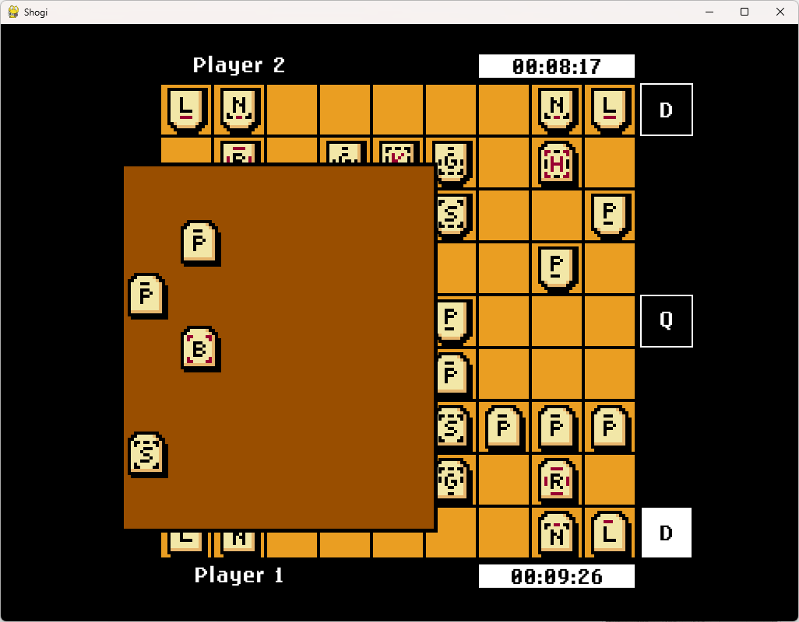

Simple implementation of [Shōgi 将棋](https://en.wikipedia.org/wiki/Shogi) board game using Python
and Pygame made as a project for Programming in Python course at AGH UST. The project consists of a
pixel-art-inspired gui and a game engine which implements game rules and logic as well as a simple
bot which utilizes the [Alpha-beta
pruning](https://en.wikipedia.org/wiki/Alpha%E2%80%93beta_pruning) search algorithm to find their
next move. The application enables one to either play against another person locally on the same
device or play against computer (bot).

## Authors

* Władysław Nieć ([@wniec](https://github.com/wniec))
* Bartosz Hanc ([@BH4N5](https://github.com/Bh4n5))
